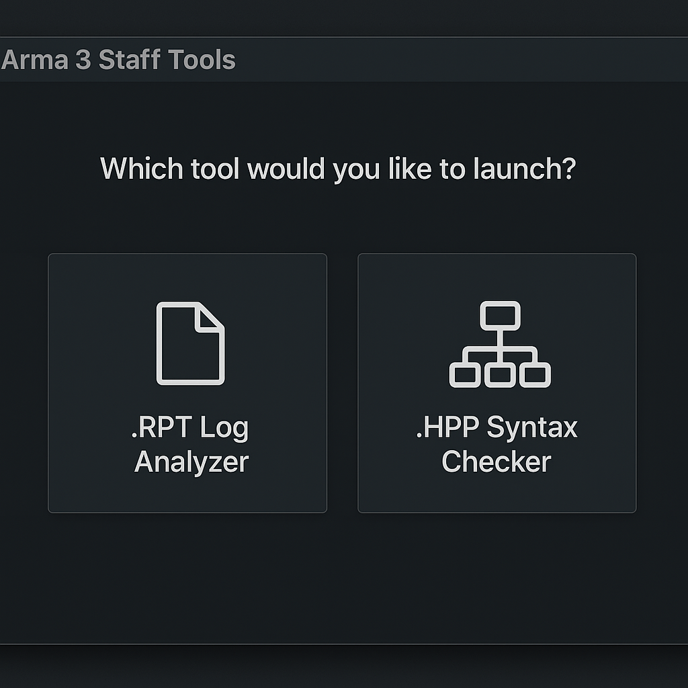
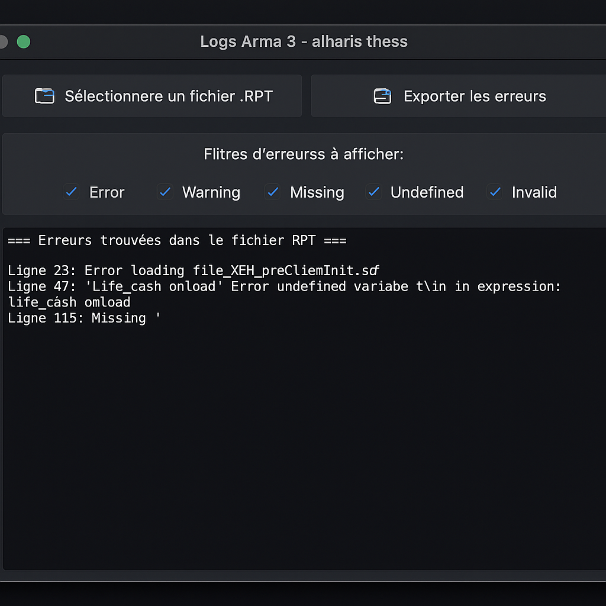
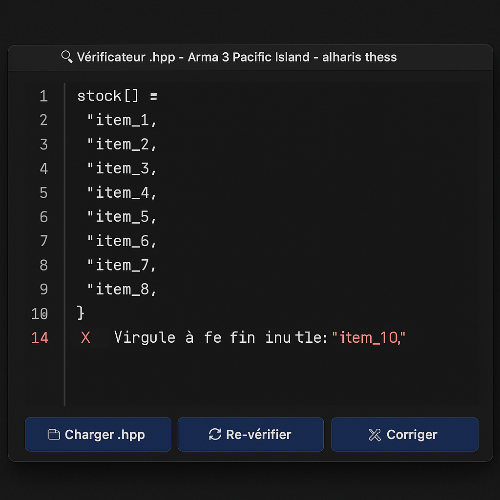

# Arma 3 Staff Tools

🛠 Handy tools for analyzing and correcting `.rpt` and `.hpp` files for Arma 3.

💡 Featuring a sleek, dark-themed user interface for easy and efficient use.

## ✨ Main Features
- **Main menu**: Choose the tool you need
- **.rpt file analyzer**: Filter and export errors
- **.hpp syntax checker**: Automatically detect and fix syntax errors

---

## 📷 Screenshots

| Main Menu                       | RPT Log Analyzer                   | HPP Syntax Checker                 |
|---------------------------------|-------------------------------------|-------------------------------------|
|           |       |    |

---

## 🚀 Usage

If you just want to use the tools, download the **Windows executable (`.exe`)** file from the repository’s **Releases** section and run it – no need to install Python!

If you’d like to explore or modify the source code, make sure you have **Python 3.10 or later** installed. Clone the repository, then run:

```bash
python arma3stafftools.py
